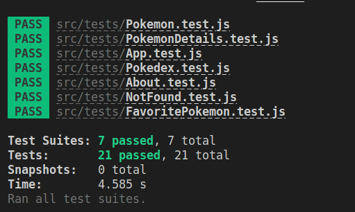

# React Testing Library

# Sobre o Projeto

Neste projeto foi criado testes para uma aplicação já existente.

## Foram testados:

- Funções assíncronas;
- Links de navegação;
- Tags;
- Componentes;
- Botões;
- Imagens;

## Habilidades desenvolvidas:

- Utilizando os seletores (queries) da React-Testing-Library em testes automatizados;
- Simular eventos com a React-Testing-Library em testes automatizados;
- Testar fluxos lógicos assíncronos com a React-Testing-Library;
- Escrever testes que causam a refatoração da estrutura dos componentes da aplicação sem necessidade de serem alterados;
- Entradas Testar.

##  Teste aprovado.



## Como executar:

```bash
# clonar repositório

- git@github.com:bruna270498/Projeto-React-Testing-Library.git

# Instale as dependências

- npm install.
```


## Colaboradores:

Esta aplicação de Pokedéx foi criada pela Trybe. A minha participação foi somente a criação de testes.
